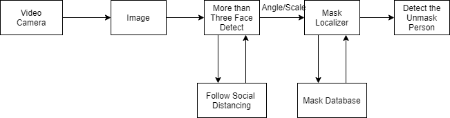

# Social-Distancing-and-Mask-Detection-BE-Project
-------------------------------------------------------------------------------------------------------------------------
# Algorithms:

CNN (Convolutional Neural Network):
 
 
Object from an image is identified by CNN. First, the image's 
pixels are fed as input, and then the input layer accepts the 
image's pixels as input.
Hidden layers extract features by conducting specific 
calculations and transformations. To detect patterns in the 
image, this layer employs a matrix filter and convolution 
operations. Finally, the object in the image is identified by a 
fully connected layer. Convolutional neural network is a 
feed-forward neural network that processes data in a grid like topology to analyses visual images. Convolution layers, 
ReLu layers, the fully connected layer, and the Pooling layer 
are the four Hidden Layers. Convolution is the process of 
coiling or twisting data and altering it to find a new pattern. 
Convolution operations are carried out by several filters in 
the convolution layer. The next step is to move the maps and 
features to the ReLu layer after they have been extracted.
Multiple convolutions and a Relu layer are used to scan the 
real image and locate features. The rectified feature map 
now travels via a pooling layer(vast information is reduced 
to a single response).Pooling is a down sampling process 
that decreases the feature map’s dimensionality.Thepooling 
layer employs many filters to identify various aspects of an 
image, such as borders ,corners ,body, and so on.
From a parallel pooled featured map, a single long 
continuous linear vector is generated by flattening the 
resulting 2D arrays. The fully connected layer receives the 
flattened matrix from the pooling layer as input to identify 
the image.
 
 

 
CNN 
 
 
Yolo V3 (You Only Look Once - version 3):
 
 
 It detects objects using 
CNN. It can detect numerous objects in an image. It predicts 
not only the class of the object but also its location in the 
image. For the object detection task, Yolo version 3 employs 
a neural network of 53 CNN's (Darknet-53) and an additional 
53 layers, totaling 106 layers. 
This neural network divides images into regions and assigns 
cell probabilities to each of them.
Yolo estimates the number of bounding boxes needed to 
cover specific areas of the image and chooses the best ones 
based on probabilities.
The network receives input in the form of a batch of images 
with the shape (n,w,h,3), where n is the number of images, w 
and h are the image's width and height (multiples of 32), and 
3 is the RGB channel.
Yolo version 3 is a three-scale detection algorithm, with 
detection occurring at three different layers of the CNN: 
layer-82, layer-94, and layer-106. The network down 
samples the input image by 32,16, and 8 strides of the 
network at each of these points. 
At each of these locations, 1 by 1 convolution is applied to 
down sampled outputs.
Yolo version 3 calculates three bounding boxes for each cell 
of these feature maps, with various attributes for each 
bounding box. The center coordinates (abscissa, ordinate), 
bounding box dimensions (width, height), objectness score, 
and a list of confidence classes to which the object may 
belong are among these attributes.
Yolo version 3 uses nine default anchor boxes at each of the 
three network locations to predict bounding boxes. Yolo v3 
calculates offsets to predefined anchors and predicts center 
coordinates by passing the output through the sigmoid 
function to predict the real width and height of the bounding 
box. Finally, the final output is determined by the 
'intersection over union' of these three bounding boxes.
 
 

 
Yolo V3
 
 

# Dataset:
-------------------------------------------------------------------------------------------------------------------------
The <a href="https://www.kaggle.com/revanthrex/mafadataset">MAFA dataset</a> is utilized to identify masked faces.
Benchmark datasets are a grouping of datasets of varying 
sizes that represent real-world data science scenarios.
Mafa has 35,806 disguised faces and 30,811 photos.
Masked face images also differ in face angles and degrees of 
occlusion.
The significant identified features of masked faces consist of
face orientation, eyes, face location, occlusion degree,masks,
and mask types.
Notable offerings by two distinct contributors, the current 
activity status of MAFA dataset consists of 7150 views, 1239 
downloads, and a 0.17 download per view ratio.

# Proposed Architecture:
-------------------------------------------------------------------------------------------------------------------------
The system will use continuous video footage from the IP or 
CCTV camera as input. Images are created by processing this 
video footage frame by frame.
The system will identify the persons’ faces, masks, and 
various attributes. The Euclidean distance between the faces 
will be calculated using the centroid of a rectangular box 
formed around each of the face. If there are more than three
faces in that detection and the calculated distance is less 
than the prescribed standards, a notification is sent 
indicating absence of social distance.
Fig- 3: Proposed System Architecture
Features will be extracted from those images, regardless of 
their angles or scales. The Yolo v3 algorithm would be used 
to accomplish this.
The mask localizer, a convolutional neural network-based 
classification model, receives the processed image. The 
MAFA dataset will be used to train the model and will help 
with image analysis. The system will detect if the person is 
not wearing a mask and notify.
 
 

 
Proposed Architecture
 
 

# Key Words of Project: 
-------------------------------------------------------------------------------------------------------------------------
 
<code>
  Face and Object Detection</code>
<code>
Face Mask</code>
 
 
<code>
Distance Estimation</code>
<code>
Covid 19
</code>

-------------------------------------------------------------------------------------------------------------------------
## Project Collaborators: <a href= "https://www.linkedin.com/in/garje-gaurav2000/">@Gaurav Garje</a>,<a href="https://www.linkedin.com/in/rasika-lande-a4a26b217/">@Rasika Lande</a>, <a href="https://www.linkedin.com/in/shardul-shinde-740585200/">@Shardul Shinde</a>,<a href="https://www.linkedin.com/in/nishantsinamdar/">@Nishant Inamdar</a>
-------------------------------------------------------------------------------------------------------------------------
### Project Mentor: <a href="https://www.linkedin.com/in/anuradha-deokar-18ab8013b/">@Prof A S Deokar</a>
-------------------------------------------------------------------------------------------------------------------------

Few notes:

Cannot upload the yolov3 weight file, one can download it from online sources like : https://github.com/patrick013/Object-Detection---Yolov3/blob/master/model/yolov3.weights

Cannot upload the dataset, one can download dataset from : https://www.kaggle.com/datasets/revanthrex/mafadataset/data
